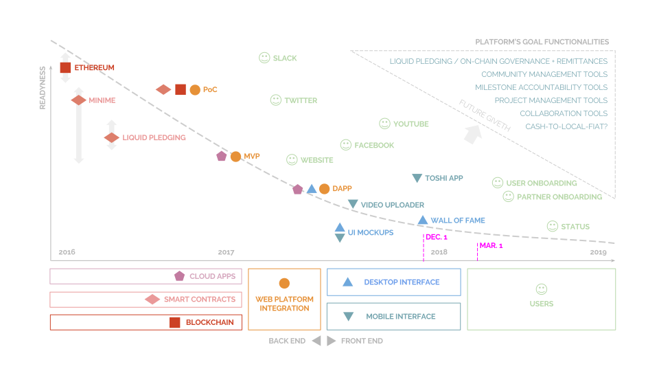

# FAQ

## When will this Wiki be finished?

Never! It is an evolving document that will continue to be updated by community members like you! ;-)

## What stuff is Giveth working on?

## What is a DAC?

A DAC is a **Decentralized Altruistic Community**.

They have a shared social media platform (like Slack, Rocket Chat, Discord, etc.) and use smart contracts to transparently allocate financial resources.

**Decentralized:** There are no central points of failure [*]. The cause that the DAC is organized around is what matters, not the leading organizations or egos. A DAC has the ability to build their own decentralized governance structure in whatever way they want, using whatever platform they want, or they can have no governance structure at all.

**Altruistic:** The cause a DAC focuses on is one that has trouble finding support in the for-profit market economy, such as helping the homeless, funding open source software projects, or supporting emergency relief after a natural disaster. The main piece is that the DAC is not focused on generating profit, they are focused on using #blockchain4good and trying to #maketheworldabetterplace in general.

**Community:** A group of individuals and organizations working together to achieve their goals.

[\*]Giveth’s Smart Contracts have centralizing security features (Like escape hatches) that are necessary in 2017 while working with this young smart contract tech, but all the centralizing security features have the ability to be turned off so the DAC can become truly decentralized; although we don’t recommend it at this stage.

<!--
## DAO Eth and Etc rescue
If you came to Giveth because the internet was referring you here to rescue your DAO tokens from the dissolved DAO, please refer to our [DAO rescue minisite](https://dao.giveth.io) for help. You should be able to get through the whole process with our collection of links on the minisite. If you still have questions, please ask in our [Slack](http://slack.giveth.io)-->

## When will I be able to collect donations for my project with Giveth?

We are currently in alpha-testing. We expect to fully open the platform for the public in March 2018. If you want to be an early adopter and prepare your projects presentation for our release, please read @krrisis medium post on the subject ['What is the future of Giving?'](https://medium.com/giveth/what-is-the-future-of-giving-d50446b0a0e4) fill out our [google form for onboarding](https://goo.gl/forms/jvdg6FDeT8Mel4VE2). Please see the official [roadmap](product-roadmap) for further details on public release.

## What will be the cost of receiving donations with Giveth's DApp?

The Giveth Donation Application is a Gift from the Giveth DAC, we will never collect any fees. However, the Ethereum network is not so alturistic. Fees are collected in the form of [Gas](https://myetherwallet.github.io/knowledge-base/gas/what-is-gas-ethereum.html).   

In our first live alpha release each milestone will take about ~2.4 mil gas. At 1 Gwei, this is 0.0024 ETH (About $1 when ether is $450):
  
Txs included are:
1. Deploy Milestone (1.7 mil) (paid by Maker)
2. 1 Donation (250k) (paid by Giver)
3. Accept Completion (34k) (paid by Reviewer)
4. Withdraw (300k) (paid by Maker)
5. Collect (32k) (paid by Maker)

The above *does not* include the confirmPayment on the vault which is a temporary security precaution paid by the Vault Owner.

The above analysis assumes no delegates, with delegates the amount will be slightly higher.
