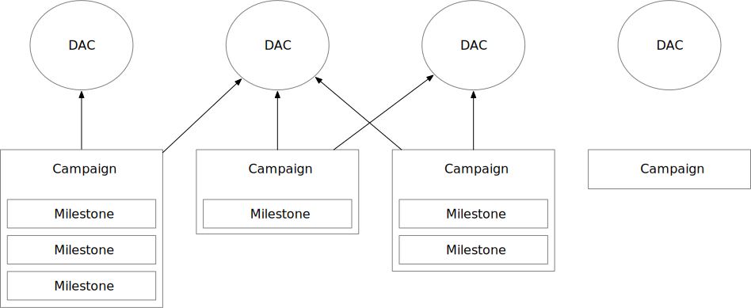
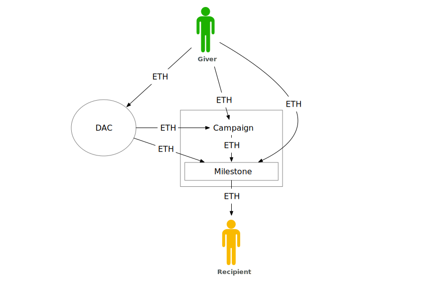
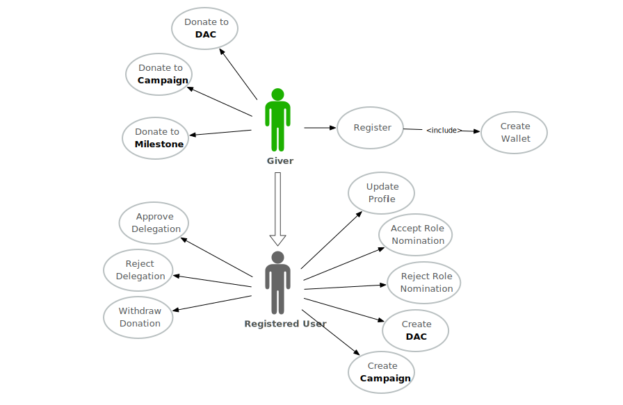
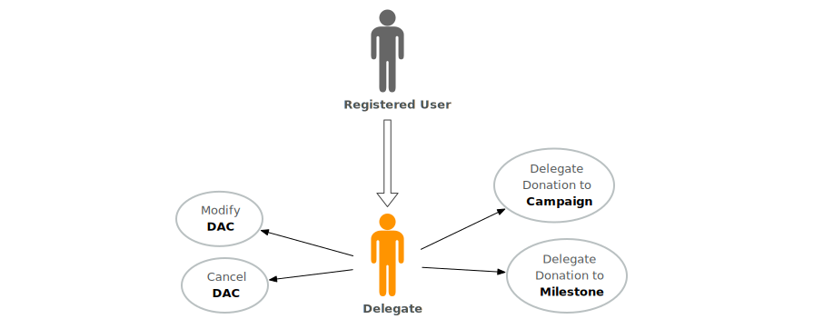
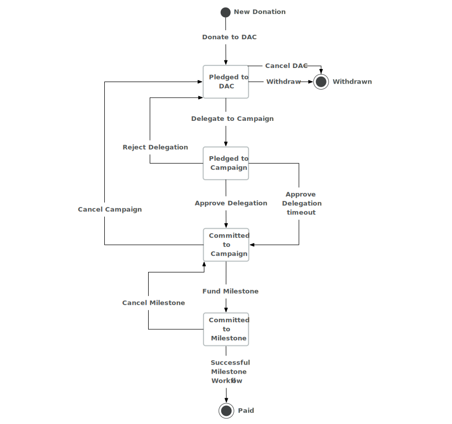
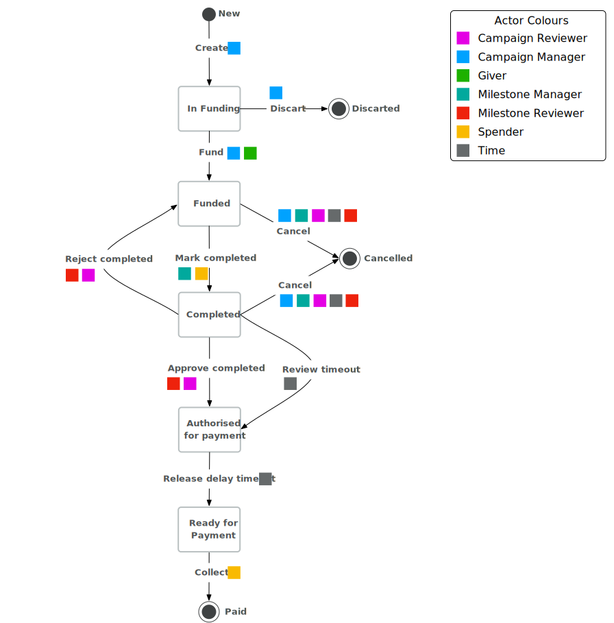

# MVP

The Giveth MVP is a minimal viable product that allows users to give money to communities built around causes. The system is a set of [smart contracts](https://github.com/Giveth) living on the [Ethereum Project blockchain](https://ethereum.org), with a [caching server](https://github.com/Giveth/feathers-giveth) and a [graphical user interface (GUI)](https://github.com/Giveth/giveth-dapp). Currently we are in a closed alpha testing phase, should you be interested to help us test the system, please contact `@vojtech` on the [Giveth Slack](http://slack.giveth.io/).

## Executive Summary

The system consists of:

- [**DACs**](#mvp-dac) short for Decentralised Altruistic Communities. Every DAC is a community built around cause to which users can donate money. A DAC is owned by a Delegate who can delegate the donations to Campaigns linked to the DAC.
- [**Campaigns**](#mvp-campaign) are individual projects with owned by a Campaign Manager. These projects have Milestones through which the people behind the Campaign can get funding.
- [**Milestones**](#mvp-milestone) can be created within a Campaign and are the only way how to get money out of the Giveth system. The Milestones can be proposed by the Campaign Manager and follow a workflow where multiple people can interact with it to ensure the milestone has been accomplished.

There are also 7 roles:

- [**Campaign Manager**](#mvp-campaign-manager) who is a sole owner of a Campaign and can fund a Milestone with campaign money.
- [**Campaign Reviewer**](#mvp-campaign-reviewer) who can cancel Campaign and who can review completion of any Milestone within the Campaign.
- [**Delegate**](#mvp-delegate) who is a sole owner of a DAC and can delegate money from the DAC to a Campaign or a Milestone within the Campaign.
- [**Giver**](#mvp-giver) who can give (donate) money to a DAC, Campaign or a Milestone.
- [**Milestone Manager**](#mvp-milestone-manager) who is responsible for making sure that a Milestone is accomplished.
- [**Milestone Reviewer**](#mvp-milestone-reviewer) who reviews the completion of a Milestone.
- [**Recipient**](#mvp-recipient) who receives the money from a completed Milestone.

## Giveth in Depth

Lets have a second, more in depth look on the Giveth system. There are 3 distinct entities build in the system which are handling the donated money. The relations between them is depicted in [Figure 1](#mvp-fig-relations). Each of the 3 entities corresponds to one or more smart contracts.

<a name="mvp-fig-relations">Figure 1</a>: Relations between DACs, Campaigns and Milestones. The DACs and Campaigns can be linked with each other, but can also stand completely alone. On the other hand, every milestone can be linked to exactly one Campaign, but multiple Milestones can exist in one Campaign.

### <a name="mvp-giver">Giver</a>

Before we dive in the different entities, lets briefly talk about arguably the most important users in our system - Givers. Under the term Giver we understand anyone who used our platform to give money to a DAC, Campaign or a Milestone. You can see all possible money flows in the [Figure 2](#mvp-fig-money-flow). Givers can interact with these 3 entities, but are not explicitely part of any unless they fullfill some other role as well. You can see the roles locality in [Figure 3](#mvp-fig-role-locality). The full list of Giver's roles is depicted in the use case diagram in [Figure 4](#mvp-fig-giver-usecase).

<a name="mvp-fig-money-flow">Figure 2</a>: All possible flows of money in the Giveth system. The Giver can give ETH to DAC, Campaign or Directly to a Milestone. From DAC the money can be delegated to a Campaign and from the Campaign the donations can be locked in a Milestone within the Campaign. The only way how money can be moved out of the system is from the Milestone to the Recipient.

<a name="mvp-fig-role-locality">Figure 3</a>: The locality of roles, all the roles have a limited scope and once the entity seize to exist so do the roles. Every DAC contains exactly one Delegate, every Campaign a Campaign Manager and Campaign Reviewer and every Milestone has a Milestone Manager, Milestone Reviewer and Recipient. The Giver is not associated with any entity explicitely but may interact with all of them.

<a name="mvp-fig-giver-usecase">Figure 4</a>: Use case diagram with all the actions the [Giver](#mvp-giver) can take.

### <a name="mvp-dac">DAC</a>

Decentralised Altruistic Communities are the most general entity in the Giveth System. The purpose of a DAC is to unite Givers around a cause and provide them with a mean to give money to a cause without having to research the projects making the change. Any money donated to a DAC can be retrieved by the Giver, however we strongly discourage Givers to do so. The funds remain in the DAC until they are delegated to a Campaign or a Milestone.

#### <a name="mvp-delegate">Delegate</a>

Delegate a registered user who is the owner of a DAC and can delegate the funds donated to it. The use case diagram in [Figure 5](#mvp-fig-delegate-usecase) shows all the actions Delegate can take. In the MVP, donations can not be split, hence any donation needs to be fully delegated to a Campaign or a Milestone. The delegation is a process where the donation pledge from the DAC is transfered to the Campaign or Milestone. Giver has 3 days to reject the delegation. After that time, the money are locked in the Campaign or a Milestone to which the money were delegated by the Delegate. This process is described in [Figure 6](#mvp-fig-dac-campaign-donation-statediagram) for delegating to Campaign and in [Figure 7](#mvp-fig-dac-milestone-donation-statediagram) for delegating directly to a Milestone.

<a name="mvp-fig-delegate-usecase">Figure 5</a>: Use case diagram with all the actions the [Delegate](#mvp-delegate) can take.

<a name="mvp-fig-dac-campaign-donation-statediagram">Figure 6</a>: State diagram for donations made to DAC that have been delegated to Campaign.

<a name="mvp-fig-dac-milestone-donation-statediagram">Figure 7</a>: State diagram for donations made to DAC that have been delegated directly to Milestone.

### <a name="mvp-campaign">Campaign</a>

In the Giveth System, a Campaign represents individual projects making changes in the world. Donations made to Campaing are locked and unless the Campaign gets cancelled, the Giver no longer has control over the donated money. The reasone why we lock the donations, is to give the people behind Campaign some level of certainty they can count on having the donated money. The previously mentioned [Figure 6](#mvp-fig-dac-campaign-donation-statediagram) describes the donation flow from a DAC and [Figure 10](#mvp-fig-campaign-donation-statediagram) shows the state diagram for direct donations to Campaign.

#### <a name="mvp-campaign-manager">Campaign Manager</a>

Campaign Manager is a registered users who has created, and is the owner, of a Campaign. The role of the Campaign manager is to create Milestones through which he/she can fund the work and people behind the project. [Figure 8](#mvp-fig-campaign-manager-usecase) depicts all the actions Campaign manager can take.

<a name="mvp-fig-campaign-manager-usecase">Figure 8</a>: Use case diagram with all the actions the [Campaign Manager](#mvp-campaign-manager) can take.

#### <a name="mvp-campaign-reviewer">Campaign Reviewer</a>
Because the donations to a Campaign are locked we have added a Campaign Reviewer role to give some oversight on the Campaign. Campaign Reviewer is a registered user who has the power to reject milestones completion, cancel milestones and even cancel campaign if neccessary. You can see all these actions in [Figure 9](#mvp-fig-campaign-reviewer-usecase).

<a name="mvp-fig-campaign-reviewer-usecase">Figure 9</a>: Use case diagram with all the actions the [Campaign Reviewer](#mvp-campaign-reviewer) can take.

<a name="mvp-fig-campaign-donation-statediagram">Figure 10</a>: State diagram for donations made to Campaign.

### <a name="mvp-milestone">Milestone</a>

Milestones can be created within a Campaign and are the only way how to get money out of the Giveth system to. Givers can donate money directly to a Milestone, the donation flow is very simple and is depicted in [Figure 14](#mvp-fig-milestone-donation-statediagram). The Milestones are following a workflow where several roles have to work with the Milestone in order for it to be complete and for the Money to leave the Giveth system (see [Figure 15](#mvp-fig-milestone-statediagram)). Each Milestone has a completion date by which it needs to be completed or it would be cancelled, requested amount of Ether and description of what work is necessary to complete the milestone.

#### <a name="mvp-milestone-manager">Milestone Manager</a>

Milestone Manager is a registered user who has been nominated by the Campaign Manager. The role of the Milestone Manager is to make sure the work and the status described in the Milestone has been achieved. Once the state has been achived, the Milestone Manager needs to mark the Milestone as complete. Should there be any major issues, he/she also has the ability to cancel the Milestone.

<a name="mvp-fig-campaign-manager-usecase">Figure 11</a>: Use case diagram with all the actions the [Milestone Manager](#mvp-milestone-manager) can take.

#### <a name="mvp-milestone-reviewer">Milestone Reviewer</a>

Because the donations to a Milestone are locked, each Milestone has a Milestone Reviewer role to keep an oversight on the Milestone progress. Milestone Reviewer is a registered user who is appointed by the Campaign Manager when the Milestone is created. He/she has the power to approve milestones completion, reject the completion or even cancel the milestone. You can see all these actions in [Figure 12](#mvp-fig-campaign-reviewer-usecase).

<a name="mvp-fig-campaign-reviewer-usecase">Figure 12</a>: Use case diagram with all the actions the [Milestone Reviewer](#mvp-milestone-reviewer) can take.

#### <a name="mvp-recipient">Recipient</a>

Milestone Recipient is a registered user who will receive payment from successfully completed milestone. In majority of cases, Recipient would be Milestone Manager as he/she is the one working on the milestone, however, there may be some cases where someone else should be rewarded for the work (for example it can be a direct payment for a bill).

<a name="mvp-fig-recipient-usecase">Figure 13</a>: Use case diagram with all the actions the [Recipient](#mvp-milestone-recipient) can take.

<a name="mvp-fig-milestone-statediagram">Figure 14</a>: State diagram for donations made to a Milestone.

<a name="mvp-fig-milestone-statediagram">Figure 15</a>: Full Milestone workflow as a state diagram. Apart from the states and actions, the diagram is also showing who is the actor that can take these actions.

### <a name="mvp-time">Time</a>

Many things in the Giveth MVP System are automatic actions that happend with time delay. The first action is delegation approval which is automatically invoked after 3 days if the user does not reject the delegation before this period times out. Second, each milestone has some timespan. Should this date be reached without getting to the `Authorised for Payment` state, the Milestone gets automatically cancelled. The next automatic action is releasing the Milestone payout once it was marked approved as complete. By default, as a security measure, money from successfully completed milestones have a 3 days period during which the funds cannot be retrieved. Lastly, if a Milestone is marked as complete and the Reviewers don't take any action, it is automatically approved to be complete and goes to the state `Authorised for Payment`.

<a name="mvp-fig-recipient-usecase">Figure 16</a>: Use case diagram with all the [Automatic Actions](#mvp-time).
