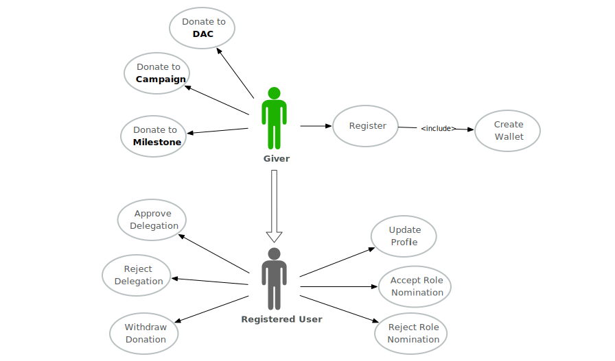
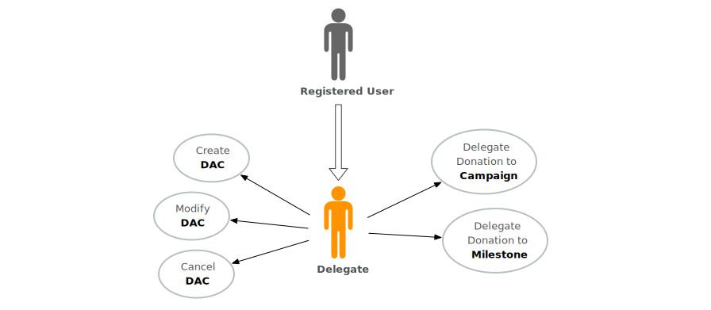
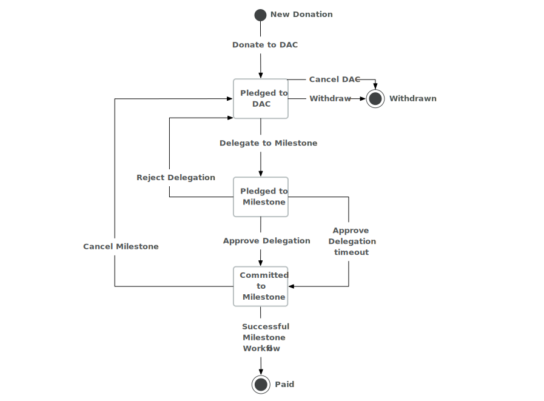

# MVP

The Giveth system is a minimal product that allows users to give money to communities around causes and to build these communities. The system is a set of [smart contracts]() living on [Ethereum Project blockchain](https://ethereum.org), [caching server]() and [graphical user interface (GUI)](). Currently we are in a closed alpha testing phase, should you be interested to help us test the system, please contact `@vojtech` on the [Giveth Slack](http://slack.giveth.io/).

## Executive Summary

The system consists of:

- [**DACs**](#mvp-dac) short for Decentralised Altruistic Communities. Every DAC is community around cause to which users can donate money. DAC is owned by a Delegate who can delegate the donations to Campaigns linked to the DAC.
- [**Campaigns**](#mvp-campaign) are individual projects with owned by a Campaign Manager. These projects have Milestones through which the people behind the Campaign can get funding.
- [**Milestones**](#mvp-milestone) can be created within a Campaign and are the only way how to get money out of the Giveth system. The Milestones can be proposed by the Campaign Manager and follow a workflow where multiple people can interact with it to ensure the milestone has been accomplished.

There are also 7 roles:

- [**Campaign Manager**](#mvp-campaign-manager) who is a sole owner of a Campaign and can fund a Milestone with campaign money.
- [**Campaign Reviewer**](#mvp-campaign-reviewer) who can cancel Campaign and who can review completion of any Milestone within the Campaign.
- [**Delegate**](#mvp-delegate) who is a sole owner of a DAC and can delegate money from the DAC to a Campaign or a Milestone within the Campaign.
- [**Giver**](#mvp-giver) who can give (donate) money to a DAC, Campaign or a Milestone.
- [**Milestone Manager**](#mvp-milestone-manager) who is responsible for making sure that a Milestone is accomplished.
- [**Milestone Reviewer**](#mvp-milestone-reviewer) who reviews the completion of a Milestone.
- [**Recipient**](#mvp-recipient) who receives the money from a completed Milestone.

## Giveth in Depth

Lets have a second, more in depth look on the Giveth system. There are 3 distinct entities build in the system which are handling the donated money. The relations between them is depicted in [Figure 1](#mvp-fig-relations). Each of the 3 entities corresponds to one or more smart contracts.

<a name="mvp-fig-relations">Figure 1</a>: Relations between DACs, Campaigns and Milestones. The DACs and Campaigns can be linked with each other, but can also stand completely alone. On the other hand, every milestone can be linked to exactly one Campaign, but multiple Milestones can exist in one Campaign.

### <a name="mvp-giver">Giver</a>

Before we dive in the different entities, lets briefly talk about arguably the most important users in our system - Givers. Under the term Giver we understand anyone who used our platform to give money to a DAC, Campaign or a Milestone. You can see all possible money flows in the [Figure 2](#mvp-fig-money-flow). Givers can interact with these 3 entities, but are not explicitely part of any unless they fullfill some other role as well. You can see the roles locality in [Figure 3](#mvp-fig-role-locality). The full list of Giver's roles is depicted in the use case diagram in [Figure 4](#mvp-fig-giver-usecase).

<a name="mvp-fig-money-flow">Figure 2</a>: All possible flows of money in the Giveth system. The Giver can give ETH to DAC, Campaign or Directly to a Milestone. From DAC the money can be delegated to a Campaign and from the Campaign the donations can be locked in a Milestone within the Campaign. The only way how money can be moved out of the system is from the Milestone to the Recipient.

<a name="mvp-fig-role-locality">Figure 3</a>: The locality of roles, all the roles have a limited scope and once the entity seize to exist so do the roles. Every DAC contains exactly one Delegate, every Campaign a Campaign Manager and Campaign Reviewer and every Milestone has a Milestone Manager, Milestone Reviewer and Recipient. The Giver is not associated with any entity explicitely but may interact with all of them.

<a name="mvp-fig-giver-usecase">Figure 4</a>: Use case diagram with all the actions the [Giver](#mvp-giver) can take.

### <a name="mvp-dac">DAC</a>

Decentralised Altruistic Communities are the most general entity in the Giveth System. The purpose of a DAC is to unite Givers around a cause and provide them with a mean to give money to a cause without having to research the projects making the change. Any money donated to a DAC can be retrieved by the Giver, however we strongly discourage Givers to do so. The funds remain in the DAC until they are delegated to a Campaign or a Milestone.

#### <a name="mvp-delegate">Delegate</a>

Delegate a registered user who is the owner of a DAC and can delegate the funds donated to it. The use case diagram in [Figure 5](#mvp-fig-delegate-usecase) shows all the actions Delegate can take. In the MVP, donations can not be split, hence any donation needs to be fully delegated to a Campaign or a Milestone. The delegation is a process where the donation pledge from the DAC is transfered to the Campaign or Milestone. Giver has 3 days to reject the delegation. After that time, the money are locked in the Campaign or a Milestone to which the money were delegated by the Delegate. This process is described in [Figure 6](#mvp-fig-dac-campaign-donation-statediagram) for delegating to Campaign and in [Figure 7](#mvp-fig-dac-milestone-donation-statediagram) for delegating directly to a Milestone.

<a name="mvp-fig-delegate-usecase">Figure 5</a>: Use case diagram with all the actions the [Delegate](#mvp-delegate) can take.

<a name="mvp-fig-dac-campaign-donation-statediagram">Figure 6</a>: State diagram for donations made to DAC that have been delegated to Campaign.

<a name="mvp-fig-dac-milestone-donation-statediagram">Figure 7</a>: State diagram for donations made to DAC that have been delegated directly to Milestone.

### <a name="mvp-campaign">Campaign</a>

#### <a name="mvp-campaign-manager">Campaign Manager</a>

#### <a name="mvp-campaign-reviewer">Campaign Reviewer</a>

### <a name="mvp-milestone">Milestone</a>

#### <a name="mvp-milestone-manager">Milestone Manager</a>

#### <a name="mvp-milestone-reviewer">Milestone Reviewer</a>

#### <a name="mvp-recipient">Recipient</a>

You can see a graphical representation in this presentation https://drive.google.com/file/d/0B60avMx-H9BCTGszU2VNcEhzdTA/view?usp=sharing and in this use case diagram https://drive.google.com/file/d/0B60avMx-H9BCZmxJX3VaQkEzTWM/view?usp=sharing

 The donation to the Campaign will not be capped, but there will be a warning shown if the campaign already has as much money as is the sum of its milestones.
